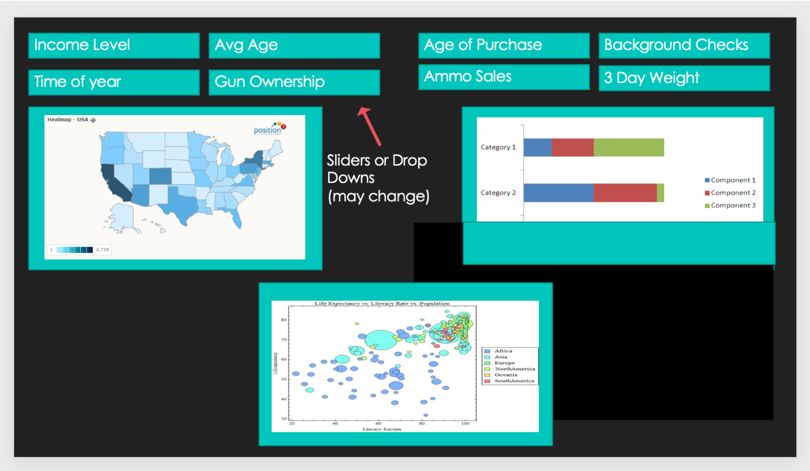
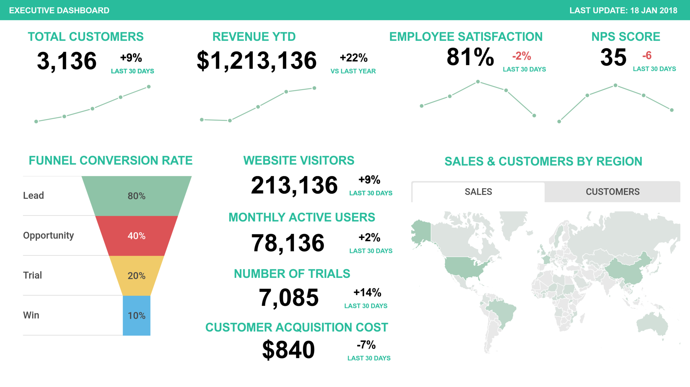
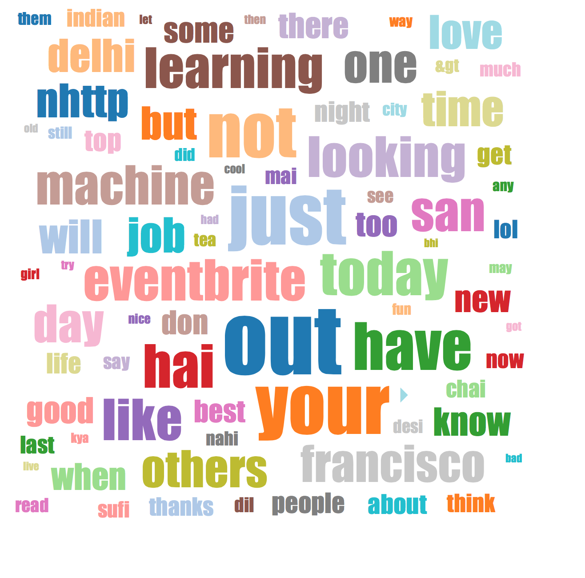

# Gun Violence

### Authors
Mary Phillipuk, Rachel Berkowitz, Kathleen Freeberg, Huma Ghiya

## Project Overview

### Gun Violence in the United States

We are interested in investigating the incidents of gun violence in relation to income demographics, firearm provisions by state, active firearm licenses, fatal police shootings and time of year. To demonstrate our findings we will be creating a dashboard with multiple charts and maps that will be updatable with selection controls, possibly including custom D3 charts.  

### Datasets

  US Gun Violence January 2013-2018 \
  https://www.kaggle.com/jameslko/gun-violence-data#gun-violence-data_01-2013_03-2018.csv 

  Fatal Police shooting 2015- (with census data)  \
  https://www.kaggle.com/kwullum/fatal-police-shootings-in-the-us#PoliceKillingsUS.csv  

  Insightful and vast USA Statistics – Homeowner information based on mortgages  \
  https://www.kaggle.com/goldenoakresearch/us-acs-mortgage-equity-loans-rent-statistics#Income_Methodology.pdf 

  Mass shootings 1966-2017  \
  https://www.kaggle.com/zusmani/us-mass-shootings-last-50-years 

  Firearm provisions by state 1991-2017  \
  https://www.kaggle.com/jboysen/state-firearms  

  Firearm Licenses - Active firearm sales licenses in the United States \
  https://www.kaggle.com/doj/federal-firearm-licensees

### Sketch

### Insperations
1.

2.

3.
